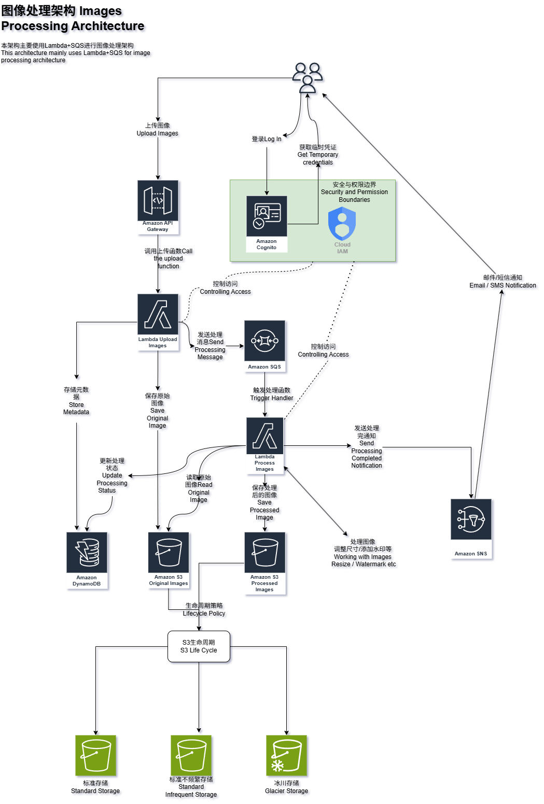
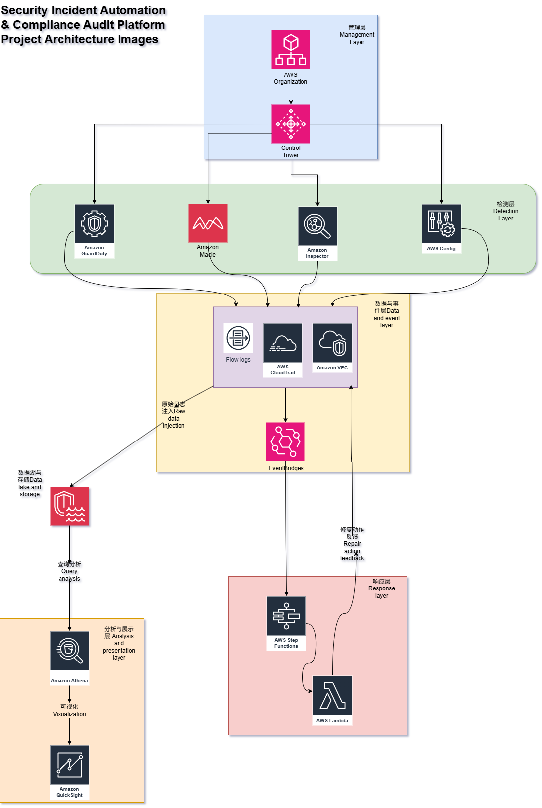
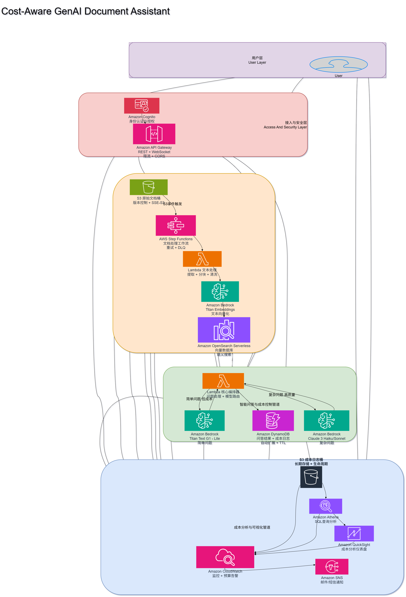

# README

<p align="center">
  
  
  
  
  
  
  
</p>

#### 🌐 Language / 言語 / 语言

&nbsp;&nbsp;🇺🇸 English: [README.md](README.md)                     &nbsp;&nbsp;🇯🇵 日本語: [README.ja.md](README.ja.md)                        &nbsp;&nbsp;🇨🇳 中文: [README.zh-CN.md](README.zh-CN.md)

## 📊 ポートフォリオ概要

| 指標 | 数値 |
|:----:|:----:|
| 🏗️ **本番級 AWS プロジェクト** | **3 つ** |
| 🧩 **使用 AWS サービス** | **15+** |
| 📐 **アーキテクチャ設計書** | **10+** |
| ⚡ **サーバーレス Lambda 関数** | **8 つ** |
| 🤖 **コア分野** | **AI + クラウド + セキュリティ** |
| 🔄 **CI/CD 対応** | ✅ |
| 🌐 **多言語ドキュメント** | **英語 / 中文 / 日本語** |
| 🔒 **最小権限 IAM 設計** | ✅ |

## 🎯 なぜこのリポジトリを作ったのか？

本リポジトリは実践的なクラウドエンジニアリング能力を示すことを目的としています — 単なるソースコードではありません。

☁️各 AWS プロジェクトには以下が含まれます：

| ✓ アーキテクチャ図 | ✓ IAM ポリシー | ✓ デプロイガイド |
|:-----------:|:----------:|:---------:|
| ✓ 監視設定 | ✓ セキュリティ設計 | ✓ サンプルデータ |
| ✓ プロジェクト管理計画 | ✓ 多言語ドキュメント | ✓ トラブルシューティングガイド |

## 🏆 注目プロジェクト

### ☁️ AWS クラウドプロジェクト

#### 1. コスト考慮型 GenAI ドキュメントアシスタント

> **インテリジェントなコスト最適化サーバーレス RAG システム — 精度とコストのバランスを実現**

**アーキテクチャフロー**
```
S3 アップロード → SQS → Lambda（ドキュメントプロセッサー）
                    ↓
            埋め込み生成器 → ベクトルストア
                    ↓
クエリルーター（ベクトル検索 / 直接 LLM）→ Bedrock → レスポンス
```

**AWS サービス**：Lambda · S3 · SQS · Bedrock · IAM · CloudWatch

**主な特徴**
- 🧠 コスト考慮型クエリルーティング、ベクトル検索または直接 LLM 呼び出しをインテリジェントに選択
- ⚡ 4 つの Lambda 関数が連携する非同期パイプライン設計
- 🔒 完全な最小権限 IAM アーキテクチャ

➡️ **[詳しく見る →](./AWS%20Project/Cost-Aware%20GenAI%20Document%20Assistant/README.CN.md)**

#### 2. サーバーレス画像処理システム

> **自動スケールする画像アップロード＆処理パイプライン — サーバー運用ゼロ**

**アーキテクチャフロー**
```
Cognito ユーザー → Lambda（アップロード URL 生成）→ S3 署名付き URL
                                              ↓
                                        S3 アップロードイベント
                                              ↓
                                      SQS → Lambda（画像プロセッサー）
                                              ↓
                                    DynamoDB（メタデータ）+ SNS（通知）
```

**AWS サービス**：Lambda · S3 · SQS · Cognito · DynamoDB · SNS · CloudWatch

**主な特徴**
- 🔐 Cognito 認証に基づく安全な署名付き URL アップロード
- 📦 オリジナル画像/処理済み画像を分離して保存、ユーザーディレクトリごとに隔離
- 📊 カスタム S3 ストレージメトリクス、CloudWatch ダッシュボードと連携

➡️ **[詳しく見る →](./AWS%20Project/Images%20Processing%20Project/README.CN.md)**

#### 3. セキュリティインシデント自動化 & コンプライアンス監査プラットフォーム

> **AWS 集中型セキュリティログ分析 — 自動検出 & 監査対応**

**アーキテクチャフロー**
```
CloudTrail → S3（KMS 暗号化）
                ↓
        EventBridge ルール → Lambda → Step Functions（インシデント対応）
                ↓
            Athena（アドホッククエリ）→ QuickSight（ダッシュボード）
```

**AWS サービス**：CloudTrail · S3 · KMS · EventBridge · Lambda · Step Functions · Athena · QuickSight · IAM

**主な特徴**
- 🛡️ エンドツーエンド KMS 暗号化 + 最小権限 IAM
- 🔄 自動インシデント検出 + Step Functions 対応ワークフロー
- 📈 コンプライアンス対応アーキテクチャ、Athena 監査クエリをサポート

➡️ **[詳しく見る →](./AWS%20Project/Security%20Incident%20Automation%20%26%20Compliance%20Audit%20Platform%20Project/README.CN.md)**

## 🖼️ アーキテクチャ図一覧

<table>
<tr>
<td align="center">
<b>画像処理システム</b><br>

</td>
<td align="center">
<b>セキュリティ監査プラットフォーム</b><br>

</td>
<td align="center">
<b>GenAI ドキュメントアシスタント</b><br>

</td>
</tr>
</table>

## 🐍 アルゴリズム & データサイエンス

| プロジェクト | 説明 | 技術ポイント |
|:----:|:----:|:------:|
| A\* 経路計画 | 古典的ヒューリスティック探索アルゴリズム | ヒューリスティック探索、経路最適化 |
| K-Means クラスタリング | 教師なし機械学習クラスタリング | セントロイドクラスタリング、教師なし学習 |
| ファジィ推論システム | ファジィロジック推論エンジン | メンバーシップ関数、ルールベース推論 |
| VGG-16 | CNN 画像分類モデル | ディープラーニング、転移学習 |
| ウェブクローラー | ウェブデータスクレイピングと抽出 | HTTP リクエスト、HTML 解析 |

## 🛠️ 技術スタック

| カテゴリ | 技術 |
|------|------|
| **☁️ クラウドコンピューティング** | AWS Lambda, S3, SQS, SNS, Cognito, DynamoDB, CloudTrail, Athena, QuickSight, EventBridge, Step Functions, Bedrock, KMS, IAM, CloudWatch |
| **🐍 プログラミング言語** | Python, Java, C++, SQL |
| **🏗️ インフラストラクチャ** | サーバーレスアーキテクチャ、IAM ポリシー、CI/CD（GitHub Actions） |
| **🤖 機械学習 / AI** | RAG、ベクトル埋め込み、K-Means、ファジィロジック、CNN（VGG-16）、A* アルゴリズム |
| **🔧 ツール** | Git、Draw.io、Pillow、Boto3 |

## 🗺️ ロードマップ

今後の計画：

Terraform / AWS CDK — 全プロジェクトのインフラ as Code 化
Amazon EKS — Kubernetes コンテナオーケストレーション
マルチアカウント Landing Zone — 企業級 AWS Organization アーキテクチャ
CI/CD 強化 — 完全自動化テストとデプロイパイプライン
AI Agent — ツール呼び出し機能を備えた自律型 AI エージェント
オブザーバビリティスイート — X-Ray + CloudWatch 統合監視**

## 📁 プロジェクト構成

```
my-projects-lab/
├── AWS Project/
│   ├── Cost-Aware GenAI Document Assistant/   # コスト考慮型 RAG システム
│   ├── Images Processing Project/             # サーバーレス画像処理パイプライン
│   └── Security Incident Automation &         # セキュリティログ分析 & コンプライアンス監査
│       Compliance Audit Platform Project/
├── Python code/                               # アルゴリズム、機械学習、ツール
├── Java code/                                 # Java アプリケーションとサンプル
├── C++ code/                                  # システムプログラミングプロジェクト
├── LICENSE
├── SECURITY.md
└── README.md
```

## 🚀 クイックスタート

```bash
# リポジトリをクローン
git clone https://github.com/Date0302/my-projects-lab.git

# プロジェクトディレクトリに移動
cd my-projects-lab/AWS\ Project/Images\ Processing\ Project/

# プロジェクトの README に従ってデプロイ
```

各 AWS プロジェクトには、完全なデプロイガイド、アーキテクチャ図、IAM ポリシーテンプレートが含まれています — ご自身の AWS アカウントに直接デプロイ可能です。

## 📬 お問い合わせ

クラウドアーキテクチャ、セキュリティ、AI 関連のお仕事のご相談をお待ちしています。
- 📧 **メール**：LQHJFCQY@gmail.com
- 🔗 **GitHub**：[Date0302](https://github.com/Date0302)

Issue や Pull Request も歓迎します！🙌

## 📄 ライセンス

本プロジェクトは MIT License のもとで公開されています。詳細は [LICENSE](LICENSE) ファイルをご覧ください。
